# [1) Our Next-Generation Model: Gemini 1.5](https://www.youtube.com/watch?v=BJxPKr6ixSM&t=5s)


The model delivers dramatically enhanced performance, with a breakthrough in long-context understanding across modalities.


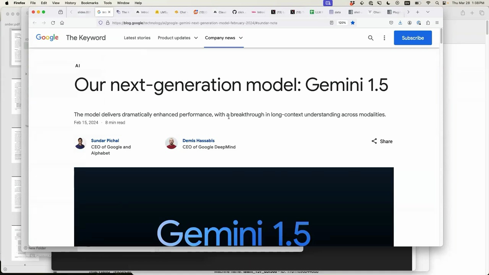

<a href="https://www.youtube.com/watch?v=BJxPKr6ixSM&t=65s">Link to video</a>


Key highlights of Gemini 1.5:


- Dramatically enhanced performance compared to previous models

- Breakthrough in long-context understanding across different modalities

- Announced by Sundar Pichai (CEO of Google and Alphabet) and Demis Hassabis (CEO of DeepMind) on Feb 15, 2024


The focus is on what can be done with AI tools right now, in the present moment, rather than speculating about future capabilities. March 2023 has seen rapid advancements, with many new things becoming possible in just the past 7 weeks that weren't achievable before.
# [2) Google's Gemini 1.5 Model Handles Video Content](https://www.youtube.com/watch?v=BJxPKr6ixSM&t=67s)


Google has released their Gemini 1.5 model, which is capable of absorbing a huge amount of content. It boasts five times the context length for input compared to Claude and is significantly larger than GPT-4. One of the most exciting features of Gemini 1.5 is its claimed ability to handle video.


## Experimenting with Gemini 1.5's Video Capabilities


To test Gemini 1.5's video handling, an experiment was conducted by providing a 7-second video panning along a bookshelf. The model was then prompted to generate a JSON array of the books in the video, including the title and author keys.


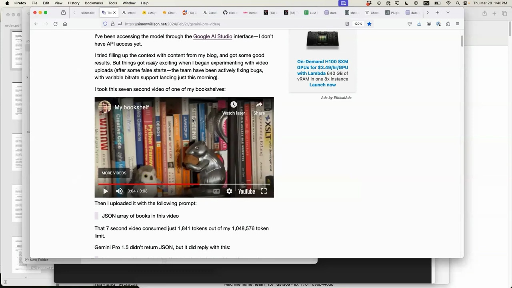

<a href="https://www.youtube.com/watch?v=BJxPKr6ixSM&t=187s">Link to video</a>


Impressively, Gemini 1.5 returned a JSON array with the titles and authors of the books on the bookshelf, despite the authors not being visible in the video. The model likely inferred the authors based on the context of the surrounding books related to web design. However, it did hallucinate one book that was not actually present on the shelf, which is not surprising given the nature of this technology.


## Limitations and Illusions


While Gemini 1.5's video handling capabilities are impressive, it's important to note that it's not entirely genuine. The model actually slices the video into one frame per second and treats them as individual images. This was discovered through the API documentation, which provides an FFmpeg command to prepare videos for use with the API.


Despite these limitations, the ability to feed an hour's worth of one-second frame videos and obtain useful results is still a significant advancement. However, there are some challenges, such as the loss of audio and the potential for the transcript to become out of sync with the video.


## Exciting Progress


Seven weeks ago, this kind of video handling was not possible, but today it is. While there are still some sharp edges to navigate, the progress made in such a short time is truly exciting. The potential applications for this technology are vast, and it will be fascinating to see how it continues to evolve and improve in the future.
# [3) Anthropic's Claude 3 Surpasses OpenAI's GPT-4](https://www.youtube.com/watch?v=BJxPKr6ixSM&t=230s)


In a surprising development, Anthropic's Claude 3 model has surpassed OpenAI's GPT-4 in performance on the ChatBot Arena leaderboard. This leaderboard is based on over 470,000 human preference votes comparing the outputs of various language models.


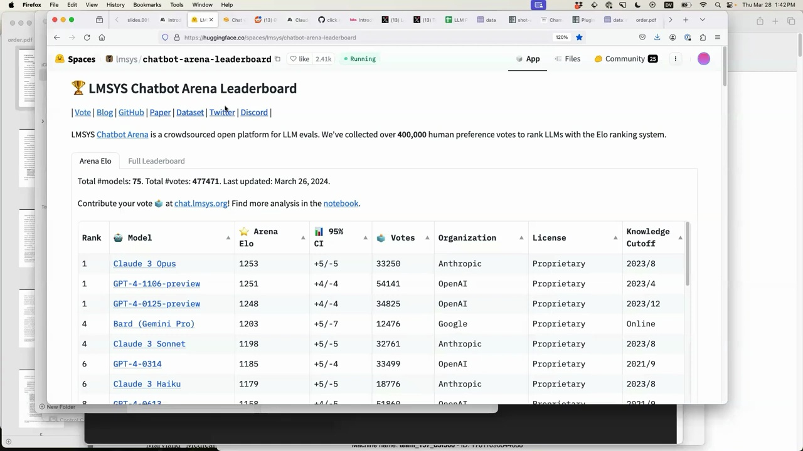

<a href="https://www.youtube.com/watch?v=BJxPKr6ixSM&t=290s">Link to video</a>


Anthropic, a company founded by former OpenAI researchers, has been quietly working on their own language models with a focus on ethics and safety. The release of Claude 3 marks the first time a model has outperformed GPT-4 on this benchmark.


## Claude 3 Haiku: Combining Language and Vision


Anthropic followed up the success of Claude 3 Opus with Claude 3 Haiku, a model that is not only cheaper and more capable than OpenAI's offerings, but also has the ability to generate haikus based on images.


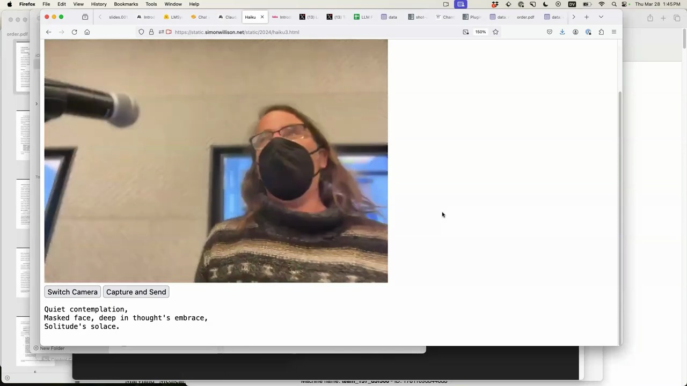

<a href="https://www.youtube.com/watch?v=BJxPKr6ixSM&t=470s">Link to video</a>


This opens up exciting possibilities for combining language and vision in novel applications. The presenter demonstrates a simple app that captures an image from a camera and generates a haiku based on the contents, all at a fraction of the cost of using OpenAI's models.


## The Future of Language Model Progress


Despite the impressive progress from Anthropic and the open-source community, OpenAI is unlikely to relinquish their position as the leader in language model performance for long. As one of their researchers tweeted:


> Hope you enjoyed some time to relax this this will have been the slowest 12 months of a progress for quite some time to come


The rapid pace of progress in this field shows no signs of slowing down, and the competition between major players like OpenAI and Anthropic, as well as the open-source community, is likely to drive even more impressive breakthroughs in the near future.
# [4) Exploring Language Model Pricing and Enriching Property Tax Data](https://www.youtube.com/watch?v=BJxPKr6ixSM&t=563s)


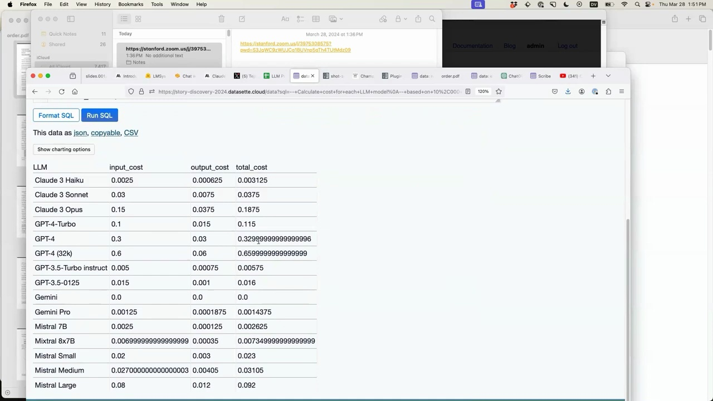

<a href="https://www.youtube.com/watch?v=BJxPKr6ixSM&t=803s">Link to video</a>


I searched the internet for an extremely basic at-a-glance comparison of pricing across various Large Language Models (LLMs) and I didn't find what I wanted, so I made one. I hope this helps someone like it helped me.


I copied and pasted the data from a Google Sheet into my dataset software. I had to adjust the schema to use floating point numbers so I could sort by price. This revealed that Google's Gemini model is currently the cheapest, being offered for free (with the caveat that prompts and responses may be used to improve the product).


I then used a new feature I built called "query this table with AI assistance". I asked it to calculate the cost for each model for 10,000 input tokens and 500 output tokens. The software generated the appropriate SQL query, which included helpful comments. This transparency is important so that journalists can apply fact-checking and peer review to the results, given the unreliability of AI systems.


The query showed that for the imaginary 10,000 token scenario, Claude 3 would cost $0.003 compared to $0.33 for GPT-4, highlighting the significant price differences.


## Enriching Champaign County Property Tax Data


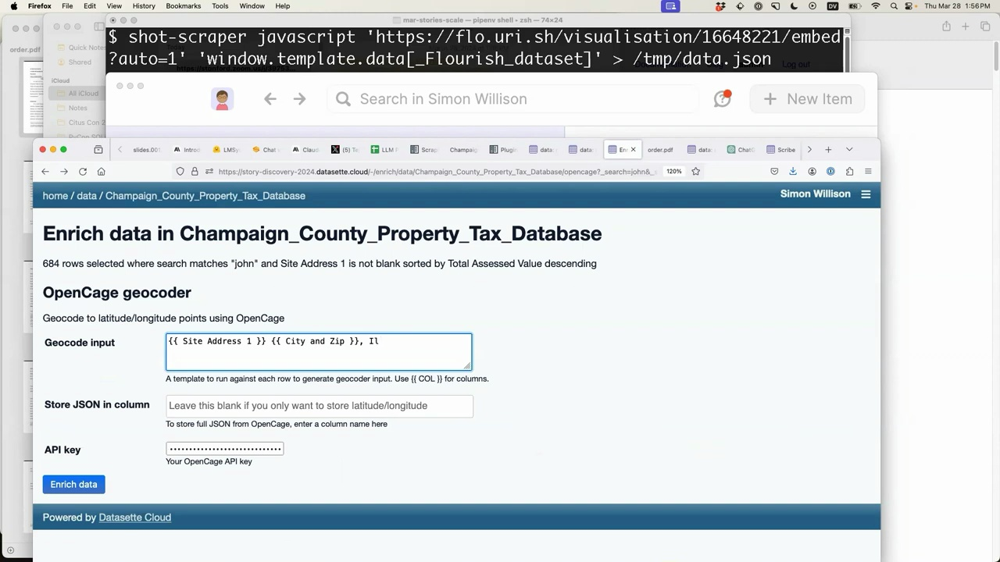

<a href="https://www.youtube.com/watch?v=BJxPKr6ixSM&t=1103s">Link to video</a>


Inspired by a talk on the searchable Champaign County property tax database, I decided to enrich this data using my dataset software. 


I used a tool I wrote called shot-scraper to extract the JSON data from the visualization page. This gave me a 17MB JSON file with 76,000 rows of data.


After uploading this to my dataset software, I set up a full text search index on the owner name column. This allows searching for specific names, like "John", and sorting the results by total assessed value to find the wealthiest Johns.


Next, I demonstrated data enrichment by geocoding the addresses. After filtering for records with an address, I used the OpenCage geocoder to add latitude and longitude columns. This allows mapping the data points.


Finally, I showed how natural language queries can be used to ask questions of the data, like "who is the richest home owner?". The software generates the appropriate SQL to answer the question.


This demonstrates the power of rapidly ingesting, enriching, and querying data to gain insights and tell stories with it as journalists.
# [5) Extracting Structured Data with Language Models](https://www.youtube.com/watch?v=BJxPKr6ixSM&t=1145s)


Language models are particularly useful for three key tasks when working with data:


1. Extracting and structuring data from unstructured sources

2. Enriching data with additional context and insights

3. Assisting with data entry and cleaning


One powerful example is extracting structured data from PDFs and images. By combining OCR techniques with large language models, we can pull out key information and organize it into a structured format.


For instance, consider this scanned PDF document:


<a href="https://www.youtube.com/watch?v=BJxPKr6ixSM&t=1505s">Link to video</a>


Using a tool like `llm`, we can convert the PDF to an image and then extract the text using a model like `gpt-3.5-turbo`:


```bash

$ llm 'gpt-3.5-turbo' order2.png 'extract text'

```


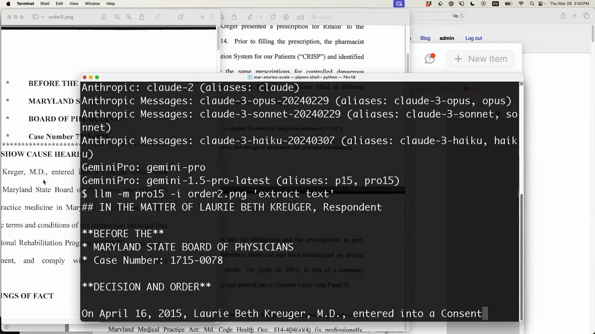

<a href="https://www.youtube.com/watch?v=BJxPKr6ixSM&t=1385s">Link to video</a>


The model does a decent job converting the scanned document into markdown text. It's important to spot check the output for any inaccuracies or hallucinations, but overall this is a promising approach.


We can go even further and have the model extract the text into a structured database table. By providing a schema for the table and some example data, the model can intelligently parse the unstructured text:


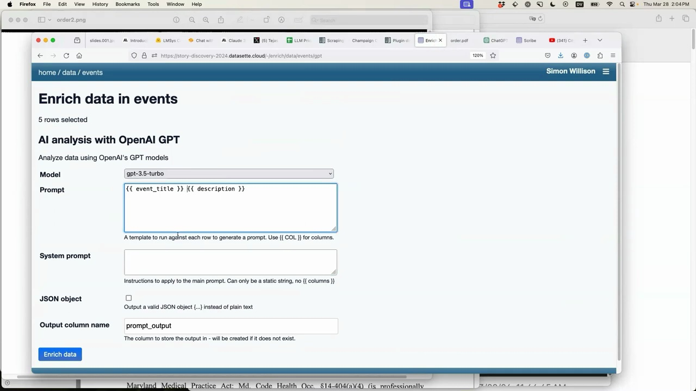

<a href="https://www.youtube.com/watch?v=BJxPKr6ixSM&t=1625s">Link to video</a>


```sql

CREATE TABLE events (

  event_title TEXT,

  event_date TEXT,

  start_time TEXT,

  end_time TEXT, 

  description TEXT

);

```


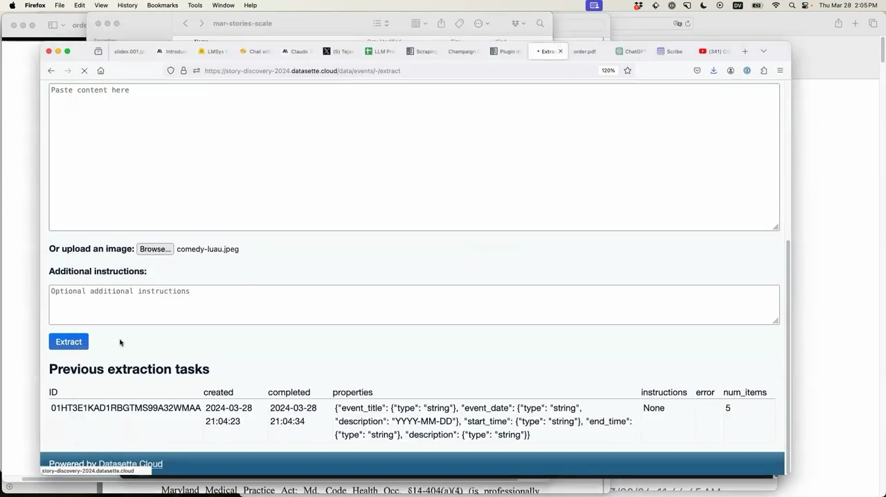

<a href="https://www.youtube.com/watch?v=BJxPKr6ixSM&t=1685s">Link to video</a>


Pasting in raw text from a webpage about upcoming jazz shows, the model is able to populate the events table with structured data in the correct format. We can even have it generate human-friendly descriptions for each event.


Finally, the same approach works on images as well. Dragging an image of an event flyer into the tool, it can extract the key details and add a new row to our events database.


<a href="https://www.youtube.com/watch?v=BJxPKr6ixSM&t=1565s">Link to video</a>


The potential applications are exciting - imagine automatically digitizing a pile of flyer photos into a structured events calendar!


While these language model powered data extraction capabilities are impressive, it's still important to validate the output with spot checks. Think of it as a highly capable data entry assistant that still needs some human oversight.


But the ability to rapidly digitize and structure data from PDFs, images, and unstructured text opens up a world of possibilities. Language models are quickly becoming an invaluable tool in the data practitioner's toolbox.
# [6) Exploring the Power of ChatGPT Code Interpreter Mode](https://www.youtube.com/watch?v=BJxPKr6ixSM&t=1745s)


ChatGPT Code Interpreter Mode is a powerful tool that allows you to ask ChatGPT questions and receive answers in the form of executable code. This mode enables ChatGPT to write and run Python code, providing a wide range of capabilities.


## Factorial Example


Let's start with a simple example. We can ask ChatGPT to calculate the factorial of 14 using the code interpreter mode:


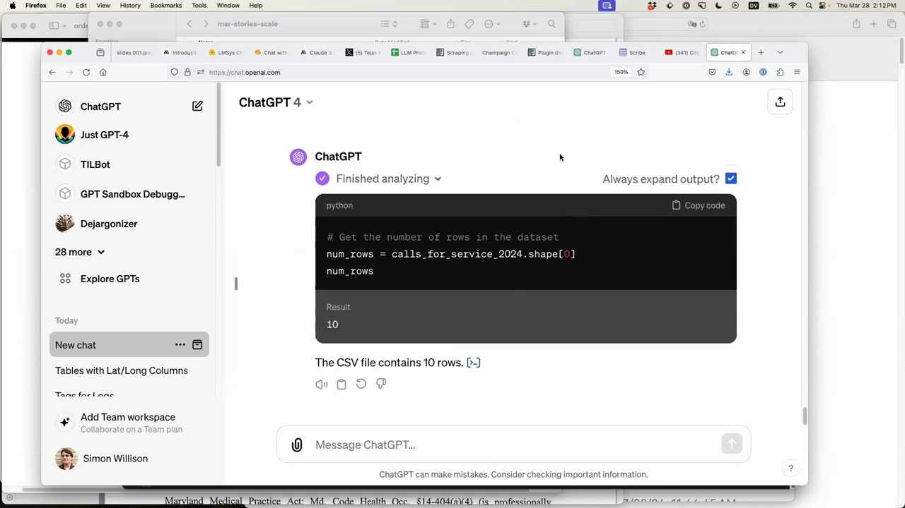

<a href="https://www.youtube.com/watch?v=BJxPKr6ixSM&t=2105s">Link to video</a>


ChatGPT not only provides the result but also shows the Python code it used to calculate the factorial. In this case, it imported the `math` module and called `math.factorial(14)`.


## Analyzing Data with ChatGPT


One of the most impressive features of ChatGPT Code Interpreter Mode is its ability to analyze data. By uploading a file, such as a CSV containing data, we can ask ChatGPT to provide insights and visualizations.


For example, given a file called `calls_for_service_2024.csv`, we can ask ChatGPT to tell us interesting things about the data:


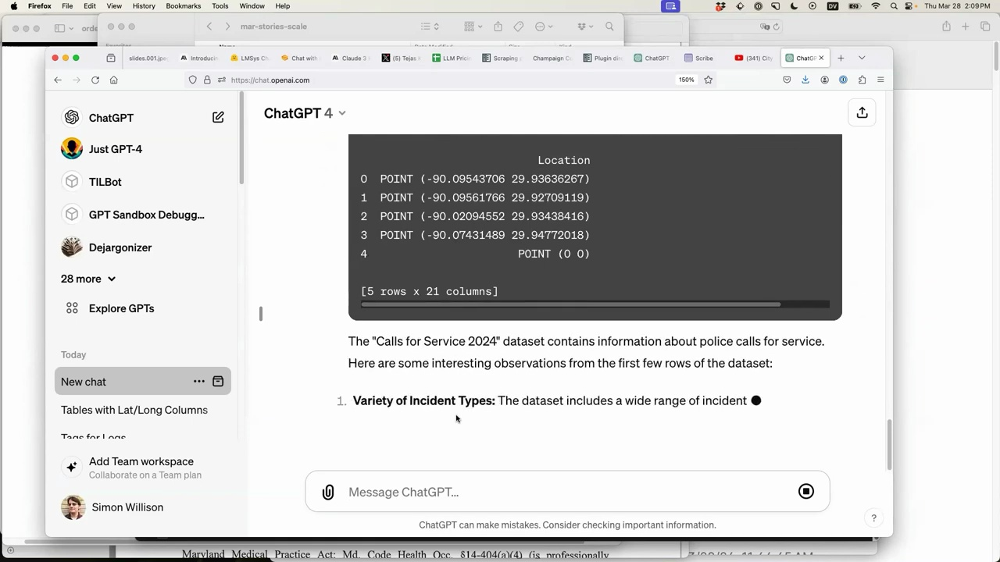

<a href="https://www.youtube.com/watch?v=BJxPKr6ixSM&t=1925s">Link to video</a>


ChatGPT imports the necessary libraries (like pandas), reads the file, and provides a summary of the data, including the variety of incident types and other observations.


We can even ask ChatGPT to create specific visualizations, such as a chart showing the number of incidents involving shootings per week over time. ChatGPT will write the code to generate the requested chart, saving us the time and effort of remembering how to use libraries like pandas and charting tools.


## The Power of Tool Usage


ChatGPT Code Interpreter Mode is an example of tool usage, where the language model is granted access to additional capabilities that allow it to interact with the real world. By giving ChatGPT the ability to run Python code and access uploaded files, we unlock a vast array of possibilities.


This tool usage is not limited to Python. With some clever prompting, ChatGPT can be coaxed into compiling C code, running JavaScript, and more. The potential applications are endless, and the ease with which these tools can be integrated into ChatGPT is truly remarkable.


## Conclusion


ChatGPT Code Interpreter Mode is a game-changer for anyone looking to leverage the power of language models for data analysis, visualization, and more. By granting ChatGPT access to tools like Python and uploaded files, we can unlock a world of possibilities and streamline our workflows in ways that were previously unimaginable.


If you haven't already, I highly recommend spending some time exploring ChatGPT Code Interpreter Mode. The results will amaze you, and the potential applications are limited only by your imagination.
# [7) Exploring the Potential of AI for Data Journalism](https://www.youtube.com/watch?v=BJxPKr6ixSM&t=2353s)


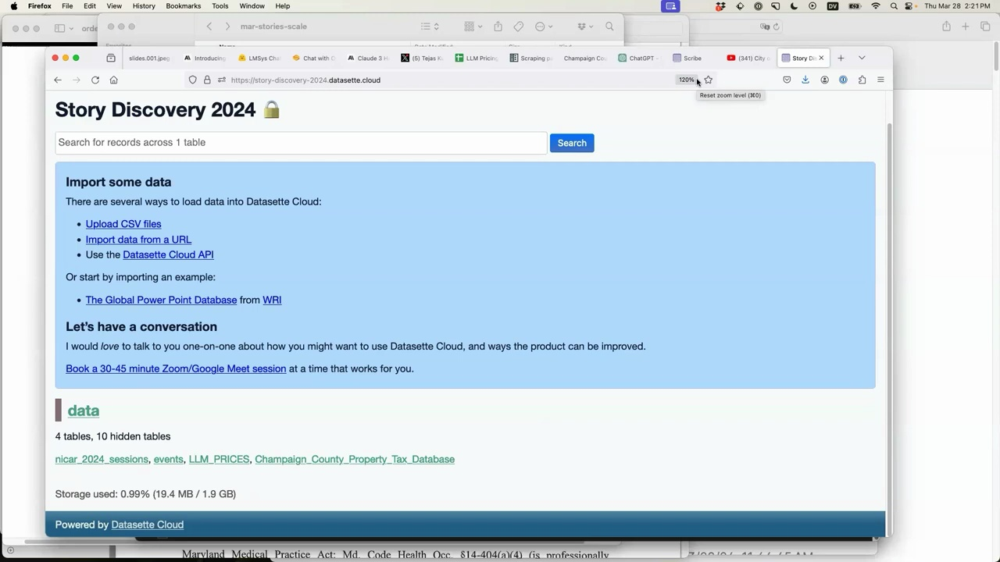

<a href="https://www.youtube.com/watch?v=BJxPKr6ixSM&t=2599s">Link to video</a>


There are several ways to load data into Datasette Cloud:


- Upload CSV files

- Import data from a URL

- Use the Datasette Cloud API


Or start by importing an example:


- The Global Power Point Database from WRI


Let's have a conversation:


I would love to talk to you one-on-one about how you might want to use Datasette Cloud, and ways the product can be improved.


Book a 30-45 minute Zoom/Google Meet session at a time that works for you.


## Semantic Search with Text Embeddings


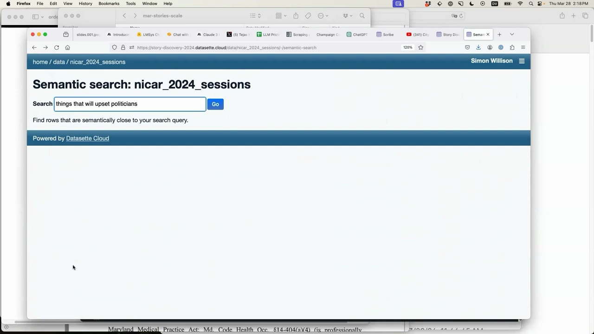

<a href="https://www.youtube.com/watch?v=BJxPKr6ixSM&t=2435s">Link to video</a>


Find rows that are semantically close to your search query.


Powered by Datasette Cloud


The text embeddings feature allows you to query your data in powerful new ways. By calculating a "magic number" for each piece of text, it enables searching for similar content even if the keywords don't directly match.


For example, searching for "things that will upset politicians" returns relevant sessions like "unleashing the power of data to expose political influence operations", even though the keywords are different. This opens up exciting possibilities for journalists to uncover insights and connections in large datasets.


## Transcribing and Searching Meeting Videos


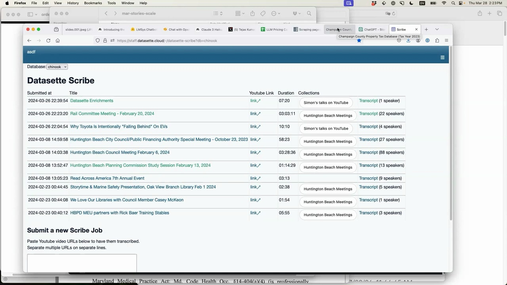

<a href="https://www.youtube.com/watch?v=BJxPKr6ixSM&t=2763s">Link to video</a>


We've been building a feature in Datasette Cloud called "Datasette Scribe". It allows you to grab a long YouTube video, like a 2-hour city council meeting, and automatically generate a searchable transcript.


The tool uses Whisper, a high-quality open source speech recognition model that supports transcription and translation for 91 languages. 


Here's an example of a transcribed Huntington Beach Council meeting. You can see:


- The YouTube video alongside the transcript

- A visualization of who spoke when 

- A chart of speaking time per person

- The ability to search across all meetings in the collection


Since the data is stored in database tables, you can run SQL queries, export to CSV/JSON, and integrate with other tools.


The next step is to add summarization - extracting key newsworthy points, detecting disagreements, identifying major themes and pulling illustrative quotes. This enables efficient fact-checking and analysis of large amounts of recorded content.


## Conclusion


The demos shown today highlight the exciting potential of AI to supercharge data journalism. From semantic search to automated transcription to data extraction and summarization, these are powerful tools we can start using and building with right now.


Importantly, the value lies not in generating fake text or images, but in augmenting and accelerating the journalistic process - finding needles in haystacks, structuring messy data, and surfacing the most salient information.


As we explore this fast-moving space, establishing best practices around fact-checking, spot-checking, and thoughtful application will be key. The goal is to harness these innovations to further the mission of uncovering truth and informing the public.